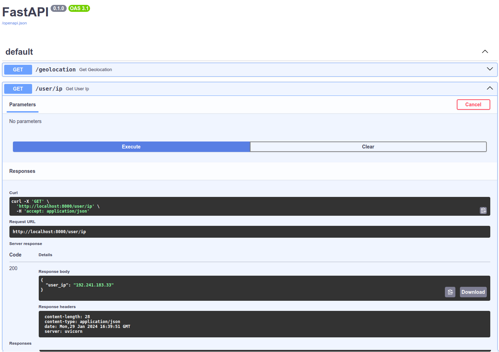

## API for Obtaining Coordinates

This API retrieves coordinates (latitude and longitude) based on the address passed in the command line.

Application written using ChatGPT 3.5.

### Step 1:

- **Request:** [here](https://chat.openai.com/share/f7491fc4-a71f-4b4c-b779-ce5be96458c1)

> Create a fastapi application with an endpoint that displays geolocation.
> The address should be obtained from the passed parameter 'q'.
> Use some Python library to determine the geolocation by address.
> Run this API on Hypercorn with three workers.
> Use nginx as a proxy server. And put all of this into Docker.
> For convenience, use Docker Compose. And show the file hierarchy so I understand where to put what.

- **Changes:**
  - Updated dependencies due to outdated specifications.
  - Python version upgraded from 3.9 to 3.12.
  - Added dependency on Hypercorn, as it was missing from requirements.txt.
  - Removed Uvicorn startup command from Dockerfile; instead, specified the command to run using Hypercorn in docker-compose.yml.
  - Minor edits in main.py to adhere to PEP8 standards (added 1 blank line before the `get_geolocation` function).

### Step 2:

 - **Request:** [here](https://chat.openai.com/share/9a01af30-71af-464b-8c72-358c5c05b810)

> I have a FastAPI application. I would like to add an endpoint that will display the real IP address of the user.
> It's possible to obtain the IP from httpbin.

