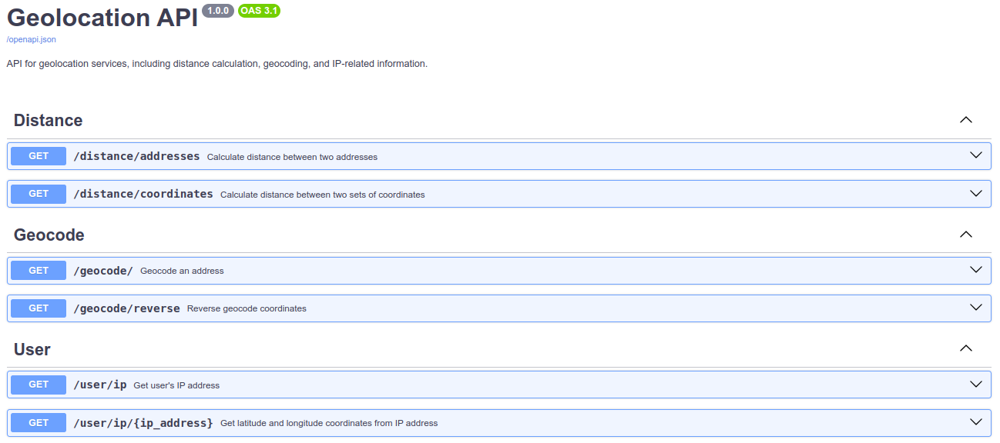

## API for Obtaining Coordinates

This API retrieves coordinates (latitude and longitude) based on the address passed in the command line.

Application written using ChatGPT 3.5.

### Step 1:

- **Request:** [here](https://chat.openai.com/share/f7491fc4-a71f-4b4c-b779-ce5be96458c1)

> Create a fastapi application with an endpoint that displays geolocation.
> The address should be obtained from the passed parameter 'q'.
> Use some Python library to determine the geolocation by address.
> Run this API on Hypercorn with three workers.
> Use nginx as a proxy server. And put all of this into Docker.
> For convenience, use Docker Compose. And show the file hierarchy so I understand where to put what.

- **Changes:**
  - Updated dependencies due to outdated specifications.
  - Python version upgraded from 3.9 to 3.12.
  - Added dependency on Hypercorn, as it was missing from requirements.txt.
  - Removed Uvicorn startup command from Dockerfile; instead, specified the command to run using Hypercorn in docker-compose.yml.
  - Minor edits in main.py to adhere to PEP8 standards (added 1 blank line before the `get_geolocation` function).


### Step 2:

 - **Request:** [here](https://chat.openai.com/share/9a01af30-71af-464b-8c72-358c5c05b810)

> I have a FastAPI application. I would like to add an endpoint that will display the real IP address of the user.
> It's possible to obtain the IP from httpbin.


### Step 3:

 - **Request:** [here](https://chat.openai.com/share/8ceb265f-7eb2-454e-a48c-62cb9c59062b)

> I have a FastAPI application.
> I would like to add another endpoint for reverse geocoding (coordinates to address) using
> the same Python package, geopy. Also, don't forget to catch possible errors.

### Step 4:
 - **Request:** [here](https://chat.openai.com/share/5c2716aa-603d-43f9-b01d-79bd1ce1e1db)

> How can I find the latitude and longitude for an IP address for free using Python?

### Step 5:
 - **Request:** [here](https://chat.openai.com/share/98d3fc0d-eb93-4149-987a-665b18dd61c4)

> Let's create a new endpoint in my FastAPI application. It will be a search for the distance between objects.
> I'm already using the geopy library. Maybe we can do something with it?

### Step 6:
  - **Request:** [here](https://chat.openai.com/share/26783b7c-16de-49f3-9342-73db1fddf1df)

> In our FastAPI application, we already have an endpoint to find the distance in kilometers between objects.
> We use the geopy library. I suggest adding an endpoint to find the distance as well, 
> but now the request arguments will be addresses instead of latitude and longitude.

### Step 7:
 - **Request:** [here](https://chat.openai.com/share/6850154c-ed76-4939-8718-801149e60f3c)

> It was a full-fledged conversation where we updated the code, caught bugs, fixed them, 
> and ultimately even managed to get something working.

### Step 8:
 - **Request:** [here](https://chat.openai.com/share/7ea50016-ed08-4995-9317-d9e2efa94157)
 - **Extra information**: This was one of the longest conversations with ChatGPT. During the conversation,
it replaced the already well-generated code with another. It was forgetting about the code that had already been 
written, coming up with non-existent calls to library methods, and a couple of other things.
> You have written a FastAPI application with several endpoints for obtaining geolocation.
> Act as the lead Python developer: I need to optimize and refactor your application and its deployment, 
> even if it's necessary to completely change the structure or code (for example, splitting a file into modules), 
> so proceed without hesitation. You will explore all possible edge cases that may lead to errors (you need to think
> of some data validation for the data that will come from users). During the process, you should focus on code 
> cleanliness, relevance, and correct usage of various third-party libraries. Provide detailed documentation for FastAPI
> endpoints so that it is displayed in Swagger, and don't forget to include descriptions not only for the endpoints 
> themselves but also descriptions of the status codes that may be displayed to the user (referring to the "responses" 
> parameter in the initialization of endpoints, for example, responses={429: {"model": YourModelName}}). 
> Please avoid code duplication, remember DRY and KISS principles. Output the final result in well-structured files and
> their refactored code. Describe everything in detail, don't skip anything!
> Here's the project structure:
```
project_root/
|-- app/
| |-- main.py
|-- Dockerfile
|-- docker-compose.yml
|-- nginx/
| |-- nginx.conf
|-- requirements.txt
```
> And here's the contents of the files: ...I copied the contents of all files...


